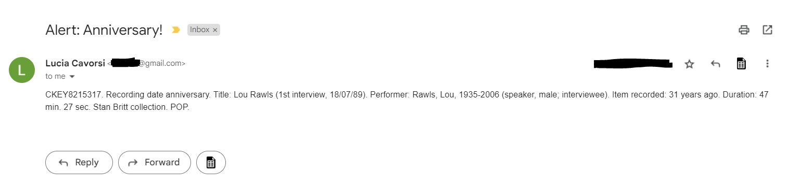

# [PYTHON: Anniversary Scripts](https://github.com/lcavorsi/Python__Anniversary_Scripts)
Scripts to flag anniversaries of recording and broadcast days via e-mail .  
(Part of PGCert in 'Applied Data Science', Birkbeck University)

# Overview
The idea behind this script is to send anniversary notifications via e-mail and it stemmed from the wish to provide content for the social media channels of the British Library - Sound Archive.  
The starting point is a BL Sound Archive [dataset](https://github.com/lcavorsi/Python__Anniversary_Scripts/blob/main/C1645_StanBritt_Collection.csv) describing the Stan Britt collection (Jazz oral history interviews and performances). The dataset holds metadata like title, ccontributors' names, subject, recording duration, recording place, recording date. The script analyses the recording dates within the dataset and sends an e-mail if, on the day the script is run, anniversaries are identified.
The date format must be DD/MM/YYYY.   
This script ignores exact dates expressed in a different format or any time indication which can not be considered an exact date (year and month only, date ranges, date thresholds like 'not after DD/MM/YYYY', 'not before DD/MM/YYYY).

The script flagging anniversaries of recording dates is [1_FlagAnniversary_Recording_dates.py'](https://github.com/lcavorsi/Python__Anniversary_Scripts/blob/main/1_FlagAnniversary_Recording_dates.py).

A second script is available, [2_FlagAnniversary_Broadcast_dates.py](https://github.com/lcavorsi/Python__Anniversary_Scripts/blob/main/2_FlagAnniversary_Broadcast_dates.py). 

The difference between the two scripts is simply due to the different format in which broadcast dates are expressed in the Sound Archive catalogue. Here, the broadcast date field also includes radio programme details, like the broadcast channel and broadcast time. Ex: BBC Radio 2 1989-08-24 22:30.
 

# Technology used
 - Python 

# Output

The notification e-mail will look like this:

